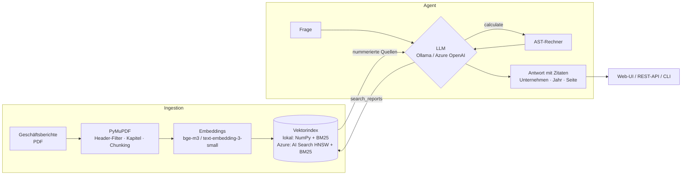
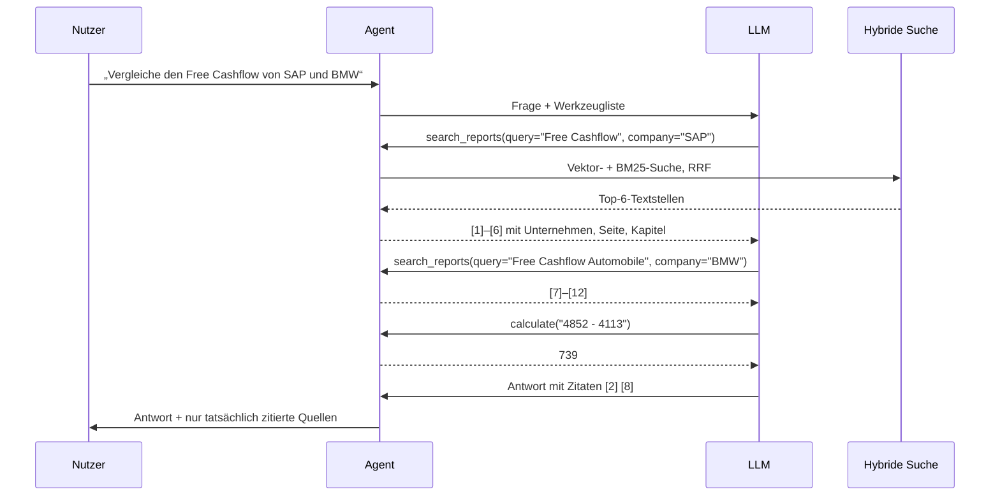

# 📊 Annual Report RAG Agent

**Ein KI-Agent, der Geschäftsberichte analysiert – mit Quellenangaben auf Seitenebene.**
Läuft **vollständig lokal** mit [Ollama](https://ollama.com) (keine Daten verlassen den Rechner) oder **cloud-nativ in Azure**
(Azure OpenAI · Azure AI Search · Blob Storage · Container Apps) – umschaltbar per Konfiguration, ohne Code-Änderung.

[](https://github.com/M0ritzD/annual-report-rag-agent/actions/workflows/ci.yml)


```text
$ arr ask "Wie hoch war der Free Cashflow der SAP 2024 und wie hat er sich zum Vorjahr verändert?"
🔧 search_reports({"company": "SAP", "query": "Free Cash Flow 2024", "year": 2024})
╭─────────────── Antwort · ollama:qwen2.5:7b-instruct-q4_k_m ───────────────╮
│ Der Free Cashflow der SAP im Geschäftsjahr 2024 betrug 4.113 Mio. €, was  │
│ um 980 Mio. € (oder um 19%) weniger als im Vorjahr lag [3].               │
│  • 2023: 5.093 Mio. €                                                     │
│  • 2024: 4.113 Mio. €                                                     │
╰───────────────────────────────────────────────────────────────────────────╯
 [3]  SAP 2024, S. 67 – Zusammengefasster Konzernlagebericht → Steuerungssystem
```

---

## Features

| | |
|---|---|
| 🤖 **Agent statt Einzel-Prompt** | Tool-Calling-Loop: Das LLM entscheidet selbst, ob es sucht, pro Unternehmen filtert oder rechnet (`search_reports`, `calculate`, `list_reports`). Unternehmensvergleiche werden in Teilrecherchen zerlegt. |
| 🔎 **Hybride Suche** | Dense-Vektoren (`bge-m3`, mehrsprachig) + BM25, kombiniert per *Reciprocal Rank Fusion*. Kennzahlen wie „EBT-Marge“ oder „4.113 Mio. €“ werden lexikalisch gefunden, Umschreibungen semantisch. |
| 📑 **Berichtsspezifische Ingestion** | Wiederkehrende Kopf-/Navigationszeilen werden statistisch erkannt und entfernt, Silbentrennung zusammengeführt, jede Seite bekommt ihr Kapitel aus dem PDF-Inhaltsverzeichnis. |
| 🧾 **Nachprüfbare Antworten** | Jede Aussage wird mit `[n]` belegt; nur tatsächlich gefundene Quellen werden ausgegeben (halluzinierte Referenzen werden verworfen). |
| 🧮 **Exaktes Rechnen** | Wachstumsraten & Margen über einen sicheren AST-Taschenrechner statt „Kopfrechnen“ des LLM. |
| 🔁 **Provider-agnostisch** | Ollama und Azure OpenAI über dieselbe OpenAI-kompatible Schnittstelle; lokaler Index oder Azure AI Search; lokale Dateien oder Blob Storage. |
| ☁️ **Infrastructure as Code** | Komplette Azure-Umgebung als Bicep inkl. Managed Identity & RBAC – **keine API-Keys im Container**. |
| ✅ **Evaluation & CI** | Fragenkatalog mit manuell verifizierten Kennzahlen, Metriken für Retrieval, Faktentreue, Zitate und Latenz; Unit-Tests ohne LLM in GitHub Actions. |

### Was man fragen kann

| Art der Frage | Beispiel |
|---|---|
| Kennzahl nachschlagen | „Wie hoch waren die Umsatzerlöse der SAP 2024?“ |
| Unternehmen vergleichen | „Vergleiche den Free Cashflow von SAP, BMW und Siemens im Geschäftsjahr 2024.“ |
| Inhaltliche Fragen | „Welche wesentlichen Risiken nennt BMW für das Geschäft mit Elektrofahrzeugen?“ |
| Rechnen | „Um wie viel Prozent ist der Current Cloud Backlog der SAP gewachsen?“ |
| Sprachübergreifend | Deutsche Frage → Treffer im englischen Siemens-Bericht („Mitarbeitende“ → *employees*) |
| Nachfragen im Chat | `arr chat` bzw. die Web-UI behalten den Gesprächsverlauf („Und wie war es bei BMW?“) |

## Architektur



**Deployment-Modi** (nur Umgebungsvariablen, siehe [`.env.example`](.env.example)):

| Modus | LLM | Embeddings | Index | Dokumente | Anwendungsfall |
|---|---|---|---|---|---|
| **Lokal** | Ollama | Ollama | lokal | lokal | Entwicklung, vertrauliche Berichte, 0 € |
| **Azure** | Azure OpenAI | Azure OpenAI | AI Search | Blob Storage | Produktiv, skalierbar, Managed Identity |
| **Hybrid** | Ollama | Ollama | AI Search | Blob Storage | Zentrale Wissensbasis, Inferenz on-prem (DSGVO) |

Möglich ist das, weil Ollama und Azure OpenAI dieselbe (OpenAI-kompatible) Schnittstelle anbieten – der Code ruft beide über
das `openai`-SDK auf, nur die Client-Erzeugung unterscheidet sich ([`llm.py`](src/annual_report_rag/llm.py)).

## So funktioniert es

Das System arbeitet in zwei Phasen: **einmalig indexieren**, danach **pro Frage recherchieren und antworten**.

### Phase 1 – Indexierung (`arr index`, einmalig)

Ziel: Die PDFs in kleine, durchsuchbare Textstücke („Chunks“) zerlegen. Code: [`ingest.py`](src/annual_report_rag/ingest.py), [`indexer.py`](src/annual_report_rag/indexer.py).

1. **Text extrahieren** – PyMuPDF liest jede Seite aus.
2. **Bereinigen** – Geschäftsberichte wiederholen auf jeder Seite dieselbe Navigationsleiste
   („An unsere Stakeholder | Konzernabschluss | …“). Zeilen, die auf mehr als 30 % aller Seiten vorkommen, werden als
   Kopf-/Fußzeilen erkannt und entfernt; Seitenzahlen fallen weg, Silbentrennungen („Umsatz-⏎erlöse“) werden zusammengeführt.
3. **Kapitel zuordnen** – Aus dem PDF-Inhaltsverzeichnis erhält jede Seite ihren Kapitelpfad,
   z. B. *Zusammengefasster Konzernlagebericht → Steuerungssystem*. So kann die Antwort das Kapitel zitieren, und die Suche kennt den Kontext.
4. **Chunking** – Der Text wird zeilen- und absatzbewusst in Stücke von ca. 1.200 Zeichen mit 200 Zeichen Überlappung
   zerlegt, damit Sätze an den Grenzen nicht verloren gehen (SAP 1.348, BMW 1.751, Siemens 672 Chunks).
5. **Embeddings** – `bge-m3` wandelt jeden Chunk (mit vorangestelltem Unternehmen und Kapitel) in einen Vektor mit
   1.024 Dimensionen um. Texte mit ähnlicher Bedeutung liegen im Vektorraum nah beieinander – auch über Sprachgrenzen hinweg.
6. **Speichern** – lokal als `chunks.jsonl` + `vectors.npy` (plus BM25-Index im Speicher) oder in Azure AI Search
   (HNSW-Vektorfeld, deutscher Analyzer, Filterfelder für Unternehmen und Jahr).

### Phase 2 – Eine Frage beantworten (`arr ask`, Web-UI, API)

Der Agent ist ein **Tool-Calling-Loop**: Das LLM entscheidet selbst, welches Werkzeug es als Nächstes nutzt, bis es genug
Informationen hat. Code: [`agent.py`](src/annual_report_rag/agent.py), [`tools.py`](src/annual_report_rag/tools.py).



1. **Planen** – Das LLM erhält die Frage, einen System-Prompt mit Regeln (immer zuerst suchen, jede Aussage belegen,
   Konzern- vor Segmentwerten, nie im Kopf rechnen) und drei Werkzeuge:
   - `search_reports(query, company?, year?)` – Suche in den Berichten, optional gefiltert
   - `calculate(expression)` – exakte Arithmetik
   - `list_reports()` – welche Unternehmen/Jahre sind indexiert?
2. **Suchen** – jede Suche ist mehrstufig ([`vectorstore.py`](src/annual_report_rag/vectorstore.py), [`query.py`](src/annual_report_rag/query.py)):
   - **Query-Expansion:** Ein DE↔EN-Finanzglossar ergänzt Fachbegriffe der anderen Sprache (BM25 ist nicht mehrsprachig).
   - **Vektorsuche** findet bedeutungsähnliche Stellen („Wie profitabel war …“ → *Betriebsergebnis*).
   - **BM25-Stichwortsuche** findet exakte Begriffe und Zahlen („EBT-Marge“, „4.113“) – entscheidend bei Kennzahlentabellen.
   - **Reciprocal Rank Fusion** kombiniert beide Ranglisten: Was in beiden weit oben steht, gewinnt.
   - **Multi-Query-Fusion:** Zusätzlich zur (oft knappen) Suchanfrage des LLM wird mit der Originalfrage gesucht und erneut fusioniert.
3. **Quellen nummerieren** – Die sechs besten Chunks gehen als `[1]` … `[6]` mit Unternehmen, Seite und Kapitel an das LLM
   zurück. Die Nummern bleiben über mehrere Suchen hinweg stabil.
4. **Weiter recherchieren oder antworten** – Das LLM kann erneut suchen (z. B. für das nächste Unternehmen) oder rechnen
   und schreibt dann die Antwort, in der jede Aussage mit `[n]` belegt ist.
5. **Validieren** – Nur Quellen, die tatsächlich gefunden wurden, landen in der Ausgabe; erfundene Referenzen wie `[99]` werden verworfen.

**Absicherungen für kleine lokale Modelle:**

| Problem | Lösung |
|---|---|
| Modell antwortet aus dem Gedächtnis, ohne zu suchen | **Forced Retrieval:** Der Agent führt die Suche mit der Originalfrage selbst aus. |
| Endlosschleife aus Tool-Calls | **Schrittlimit** (Standard 5): Danach wird eine Antwort ohne Werkzeuge erzwungen. |
| Fehlerhafte Tool-Argumente (leere Filter, „alle“, kaputtes JSON) | Werden toleriert bzw. als Fehlermeldung an das LLM zurückgegeben, damit es sich korrigieren kann. |
| Rechnen per `eval` wäre eine Sicherheitslücke | `calculate` parst den Ausdruck als AST und erlaubt nur Zahlen und Grundrechenarten – kein Code. |

## Schnellstart (lokal)

Voraussetzungen: [uv](https://docs.astral.sh/uv/), [Ollama](https://ollama.com), ~6 GB RAM frei.

```bash
git clone https://github.com/M0ritzD/annual-report-rag-agent && cd annual-report-rag-agent
uv sync

ollama pull qwen2.5:7b-instruct-q4_k_m   # Chat-Modell mit Tool-Calling
ollama pull bge-m3                       # mehrsprachige Embeddings (DE/EN)

./scripts/download_reports.sh            # SAP, BMW, Siemens 2024 (öffentliche PDFs)
uv run arr index                         # ~10 Min. auf einem MacBook M2 (3.771 Chunks)

uv run arr serve                         # → http://127.0.0.1:8000
uv run arr ask "Vergleiche den Free Cashflow von SAP und BMW 2024."
uv run arr chat                          # interaktiv mit Gesprächsverlauf
```

Eigene Berichte: PDF nach `data/reports/` legen, Eintrag in [`data/reports.json`](data/reports.json) ergänzen, `arr index`.

## Deployment in Azure

```bash
az login
./infra/deploy.sh rg-annual-report-rag swedencentral
```

Das Skript
1. deployt [`infra/main.bicep`](infra/main.bicep): Storage Account, Azure AI Search (Free-Tier), Azure OpenAI (`gpt-4o-mini`, `text-embedding-3-small`), Log Analytics, Container Apps Environment und die Container App mit **System-Managed-Identity**,
2. vergibt RBAC-Rollen (Blob Data Reader, Search Index Data Contributor, Cognitive Services OpenAI User) – der Container authentifiziert sich per Entra ID, ohne Secrets,
3. lädt die PDFs in Blob Storage und baut den Index in Azure AI Search auf,
4. gibt die öffentliche URL der Web-UI aus.

Das Container-Image wird von GitHub Actions nach `ghcr.io` gebaut. Die App skaliert auf 0 Replikas, im Leerlauf fallen praktisch nur Speicherkosten an.

**Kosten-Schätzung Demo:** AI Search Free 0 € · Container Apps im Free-Kontingent · Azure OpenAI pay-per-token (Indexierung aller drei Berichte mit `text-embedding-3-small` ≈ 0,05 €).

**Aufräumen:** `az group delete -n rg-annual-report-rag`

## Evaluation

`uv run arr eval` fährt 16 Fragen aus [`eval/questions.jsonl`](eval/questions.jsonl), deren Soll-Antworten manuell in den PDFs verifiziert wurden (Umsatz, Free Cashflow, Mitarbeitende, Dividende, … je Unternehmen).

**Ergebnis – komplett lokal** (`qwen2.5:7b-instruct-q4_k_m` + `bge-m3` auf einem MacBook Air M2, 16 GB):

| Metrik | Wert |
|---|---|
| Retrieval-Trefferquote (Top 6) | **100 %** (16/16) |
| Antwort-Genauigkeit | **81 %** (13/16) |
| Zitierquote | 94 % |
| Median-Latenz | 49 s (CPU/GPU-Limit eines 7B-Modells auf dem Laptop) |

**Fehleranalyse:** Das Retrieval findet immer die richtige Seite. Die 3 Fehler passieren bei der Generierung durch das 7B-Modell:
Bei den BMW-Auslieferungen nennt es die Zahl der Marke BMW statt der Gruppe (2,20 statt 2,45 Mio.), bei den BMW-Mitarbeitenden
übernimmt es eine Fußnotenziffer in die Zahl („159.104**3**“), und beim Siemens-Umsatz verwechselt es Umsatz mit Auftragseingang.
Das sind typische Schwächen kleiner Modelle bei dichten Kennzahlentabellen. Im Azure-Modus (`gpt-4o-mini`) bzw. mit einem
größeren lokalen Modell (`qwen2.5:14b`) sollten diese Fehler seltener auftreten.

Iterationen, die die Genauigkeit von 62,5 % auf 81 % gehoben haben: *Multi-Query-Fusion* (Suchanfrage des LLM + Originalfrage
via RRF), ein DE↔EN-Glossar für die Query-Expansion (BM25 ist nicht mehrsprachig) und Prompt-Regeln zu Konzern- vs.
Segmentwerten.

Gemessen wird:
- **Retrieval-Trefferquote** – ist eine Seite mit der gesuchten Kennzahl unter den Top-6-Treffern?
- **Antwort-Genauigkeit** – enthält die Antwort alle erwarteten Werte? (Zahlenformate wie `34.176`, `34,2 Mrd.` werden normalisiert)
- **Zitierquote** – belegt die Antwort ihre Aussagen mit Quellen?

## Grenzen

- **Latenz lokal:** Ein 7B-Modell auf einem Laptop braucht ca. 30–60 s pro Antwort; in Azure mit `gpt-4o-mini` sind es wenige Sekunden.
- **Tabellen:** PDF-Tabellen werden als Textzeilen extrahiert, nicht als strukturierte Tabellen. Bei dichten Kennzahlentabellen
  ordnet ein kleines Modell Werte daher gelegentlich der falschen Zeile oder Spalte zu (siehe Fehleranalyse oben).
- **Rechnen:** Das Modell nutzt `calculate` nicht immer zuverlässig und rundet dann selbst (z. B. 19,3 % statt 19,2 %).
- **Keine Anlageberatung:** Die Antworten sind nur so gut wie die gefundenen Textstellen – die Quellenangaben sind dazu da, sie nachzuprüfen.

**Mögliche Erweiterungen:** Tabellenextraktion als Markdown/DataFrame, Reranking mit einem Cross-Encoder, Berichte mehrerer
Jahre für Zeitreihen, LLM-as-a-Judge-Evaluation, Streaming der Antwort in der Web-UI.

## Projektstruktur

```
src/annual_report_rag/
├── ingest.py        PDF → bereinigte, kapitelbewusste Chunks
├── llm.py           Chat- & Embedding-Clients (Ollama | Azure OpenAI, Entra ID)
├── vectorstore.py   Hybride Suche: lokal (NumPy + BM25 + RRF) | Azure AI Search
├── query.py         Query-Expansion (DE↔EN-Finanzglossar)
├── storage.py       Dokumentquelle: lokal | Azure Blob Storage
├── indexer.py       Ingestion-Pipeline
├── tools.py         Agenten-Werkzeuge + sicherer Rechner
├── agent.py         Tool-Calling-Loop, Forced Retrieval, Zitat-Validierung
├── evaluation.py    Metriken
├── api.py           FastAPI (REST + Web-UI)
├── cli.py           Typer-CLI: index · ask · chat · serve · eval · upload
└── static/index.html
infra/               Bicep + Deploy-Skript
tests/               Unit-Tests (ohne LLM/Netzwerk)
eval/                Fragenkatalog
```

## Designentscheidungen

- **Warum ein Agent und nicht „klassisches“ RAG?** Bei Fragen wie „Vergleiche SAP und BMW“ liefert eine einzelne Vektorsuche meist nur Treffer eines Unternehmens. Der Agent sucht gezielt pro Unternehmen, in der Sprache des jeweiligen Berichts, und rechnet Differenzen exakt nach.
- **Forced Retrieval:** Kleine lokale Modelle (7B) überspringen manchmal den Tool-Call und antworten aus dem Gedächtnis. Der Agent erkennt das und führt die Suche selbst aus.
- **`bge-m3` statt `nomic-embed-text`:** Die Berichte sind deutsch *und* englisch; `bge-m3` ist mehrsprachig und findet deutsche Fragen auch im englischen Siemens-Bericht.
- **Hybrid statt nur Vektoren:** Finanzkennzahlen sind häufig Tabellenzeilen mit wenig Kontext – dort ist BM25 der Vektorsuche klar überlegen.
- **Managed Identity:** Keine Keys in Umgebungsvariablen oder Images; Rechte sind auf Ressourcenebene minimal vergeben.

## Tech-Stack

Python 3.11 · uv · PyMuPDF · NumPy · rank-bm25 · OpenAI SDK · Ollama · FastAPI · Typer · Rich · Pydantic Settings ·
Azure OpenAI · Azure AI Search · Azure Blob Storage · Azure Container Apps · Entra ID / Managed Identity · Bicep · Docker · GitHub Actions · pytest · Ruff

## Hinweis zu den Daten

Die Geschäftsberichte sind öffentliche Dokumente der jeweiligen Unternehmen und werden **nicht** im Repository mitgeliefert, sondern über `scripts/download_reports.sh` von den offiziellen Investor-Relations-Seiten geladen. Die Antworten des Agenten sind keine Anlageberatung.

## Lizenz

MIT
